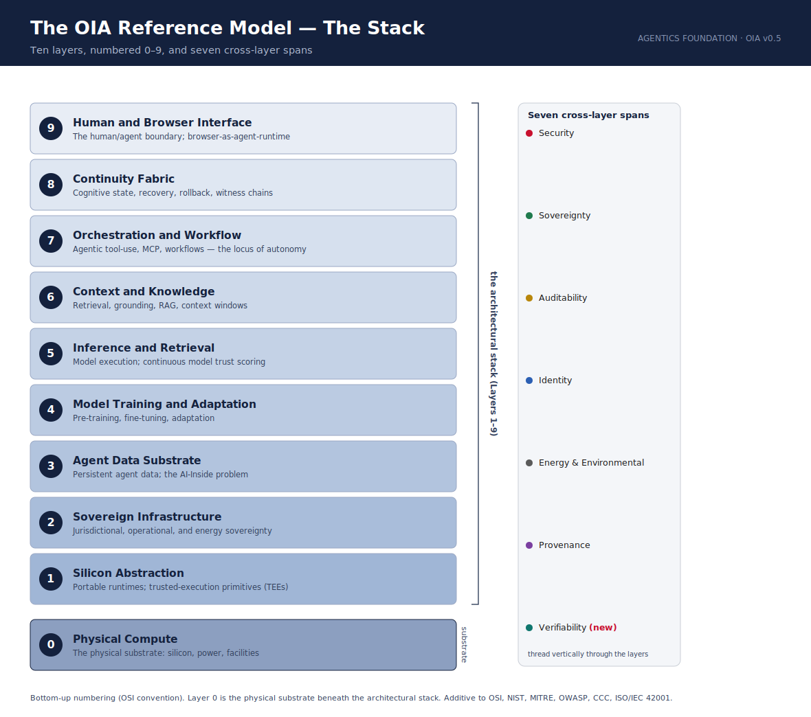

The **OIA** (Open Intelligence Architecture) is a vendor-neutral reference model for reasoning about the
security, sovereignty, and governance of intelligent systems in the enterprise — the shared architectural
frame that enterprise AI has lacked. It is **additive**, composing with OSI, NIST CSF, NIST AI RMF, MITRE
ATLAS, OWASP LLM, and ISO/IEC 42001 rather than replacing them.

> Published by the **Agentics Foundation** · Current architecture **v0.5** · Licensed **CC BY 4.0**

## The architecture at a glance

**Ten layers, seven cross-layer spans, three defining properties, four named threat surfaces.**

- **Ten layers (0–9):** Physical Compute · Silicon Abstraction · Sovereign Infrastructure · Agent Data
  Substrate · Model Training and Adaptation · Inference and Retrieval · Context and Knowledge · Orchestration
  and Workflow · Continuity Fabric · Human and Browser Interface.
- **Seven spans:** Security · Sovereignty · Auditability · Identity · Energy and Environmental Concerns ·
  Provenance · Verifiability *(new in v0.5)*.
- **Three properties:** Persistence · Autonomy · Consequence.
- **Four threat surfaces:** Mimicry · Agent-in-the-middle · Agent spoofing · Model compromise.

## Read the model

- **[Canonical Knowledge Base](https://github.com/markt-heximal/oia-model/blob/main/model/OIA-Canonical-Knowledge-Base-v0.5.md)** — the full model in structured Markdown.
- **[Reference Paper (PDF)](model/OIA-Reference-Paper-v0.5.pdf)** — the authoritative statement.
- **[Glossary](https://github.com/markt-heximal/oia-model/blob/main/docs/GLOSSARY.md)** · **[Architecture Decision Records](https://github.com/markt-heximal/oia-model/tree/main/docs/adr)** · **[Design System](https://github.com/markt-heximal/oia-model/blob/main/docs/DESIGN-SYSTEM.md)**

## The Lens System

Audience-specific overlays — the architecture is invariant; the language changes.

| Published (v0.5) | Anticipated (draft v0.1) |
|---|---|
| [CISO Lens](https://github.com/markt-heximal/oia-model/blob/main/lenses/OIA-CISO-Lens-v0.5.md) | [CFO Lens](https://github.com/markt-heximal/oia-model/blob/main/lenses/OIA-CFO-Lens-v0.1-draft.md) |
| [CIO/CTO Lens](https://github.com/markt-heximal/oia-model/blob/main/lenses/OIA-CIO-CTO-Lens-v0.5.md) | [General Counsel & Compliance Lens](https://github.com/markt-heximal/oia-model/blob/main/lenses/OIA-General-Counsel-Lens-v0.1-draft.md) |
| [Board and Risk Lens](https://github.com/markt-heximal/oia-model/blob/main/lenses/OIA-Board-and-Risk-Lens-v0.5.md) | [CHRO Lens](https://github.com/markt-heximal/oia-model/blob/main/lenses/OIA-CHRO-Lens-v0.1-draft.md) |

## Diagrams

[The Stack](visuals/OIA-Stack-v0.5.svg) · [Four Named Threat Surfaces](visuals/OIA-Threat-Surfaces-v0.5.svg) · [Lens Overlay](visuals/OIA-Lens-Overlay-v0.5.svg)

---

*The OIA Reference Model — maintained by Mark Templeton for the Agentics Foundation.
Source: [github.com/markt-heximal/oia-model](https://github.com/markt-heximal/oia-model). Licensed under
[CC BY 4.0](LICENSE).*
